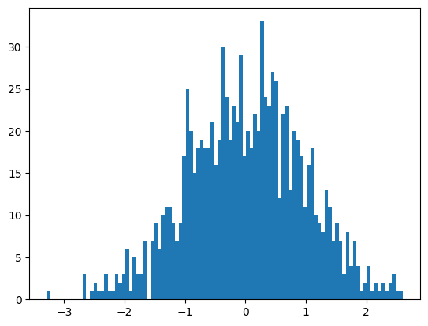
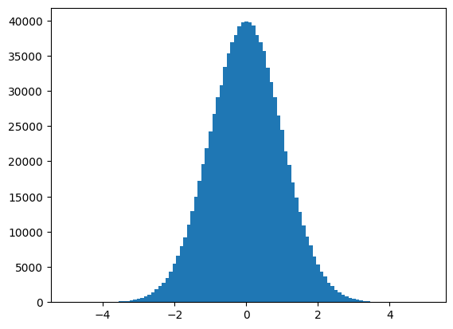

# 2024年夏季《深度学习》学习报告


| 姓名和学号？         | 杨文彬，21240213247                                         |
| -------------------- | ----------------------------------------------------------- |
| 本实验属于哪门课程？ | 中国海洋大学24夏《深度学习》                                |
| 学习内容？           | 深度学习基础                                                |
| 博客地址？           | https://blog.csdn.net/qq_18126657/article/details/141601511 |


## **一、学习目标**

学习浅层神经⽹络、⽣物神经元到单层感知器，多层感知器，反向传播和梯度消失、神经⽹络到深度学习：逐层预训练，⾃编码器。


## 二、学习内容

1.通过视频学习浅层神经网络和神经网络到深度学习。
2.通过Colab平台进行代码练习pytorch基础练习和螺旋数据分类。

Pytorch基础练习

```python
import torch
```


```python
x = torch.tensor(666)
print(x)
```

    tensor(666)


```python
x = torch.tensor([1,2,3,4,5,6])
print(x)
```

    tensor([1, 2, 3, 4, 5, 6])


```python
# 2*3的值为1
x = torch.ones(2,3)
print(x)
```

    tensor([[1., 1., 1.],
            [1., 1., 1.]])


```python
x = torch.ones(2,3,4)
print(x)
```

    tensor([[[1., 1., 1., 1.],
             [1., 1., 1., 1.],
             [1., 1., 1., 1.]],
    
            [[1., 1., 1., 1.],
             [1., 1., 1., 1.],
             [1., 1., 1., 1.]]])


```python
x = torch.empty(5,3)
print(x)
```

    tensor([[-3.1504e-09,  4.3107e-41,  3.8318e-18],
            [ 3.1538e-41,  4.4842e-44,  0.0000e+00],
            [ 1.5695e-43,  0.0000e+00,  1.4924e+17],
            [ 3.1545e-41,  4.5072e-18,  3.1538e-41],
            [ 7.1008e-19,  3.1538e-41, -5.0522e+01]])


```python
# 5*3的随机
x = torch.rand(5,3)
print(x)
```

    tensor([[0.5541, 0.7108, 0.7032],
            [0.5951, 0.6095, 0.4632],
            [0.2085, 0.6497, 0.1401],
            [0.7644, 0.2708, 0.7206],
            [0.6505, 0.3125, 0.4651]])


```python
x = torch.zeros(5,3,dtype = torch.long)
print(x)
```

    tensor([[0, 0, 0],
            [0, 0, 0],
            [0, 0, 0],
            [0, 0, 0],
            [0, 0, 0]])


```python
y = x.new_ones(5,3)
print(y)
```

    tensor([[1, 1, 1],
            [1, 1, 1],
            [1, 1, 1],
            [1, 1, 1],
            [1, 1, 1]])


```python
# 形如x的
z = torch.randn_like(x,dtype=torch.float)
print(z)
```

    tensor([[-1.0388, -2.3337, -1.7340],
            [ 0.7784, -0.3221,  0.9982],
            [ 1.3350, -1.0260, -0.0134],
            [-0.9207, -2.0933,  0.2720],
            [ 0.1050, -0.5342, -0.4612]])


```python
# 以数组创建
m = torch.Tensor([[2,5,3,7],
          [4,2,1,9]])
print(m.size(0),m.size(1),m.size(),sep='--')
```

    2--4--torch.Size([2, 4])


```python
print(m.numel())
```

    8


```python
print(m[0][2])
```

    tensor(3.)


```python
print(m[:,1])
```

    tensor([5., 2.])


```python
print(m[0,:])
```

    tensor([2., 5., 3., 7.])


```python
v = torch.arange(1,5)
print(v)
```

    tensor([1, 2, 3, 4])


```python
m = m.float()
v = v.float()
m @ v
```


    tensor([49., 47.])


```python
m[[0],:]@v
```


    tensor([49.])


```python
m + torch.rand(2,4)
```


    tensor([[2.3722, 5.8714, 3.3408, 7.3027],
            [4.5292, 2.2979, 1.3222, 9.0571]])


```python
# 转置
print(m.t())
print(m.transpose(0,1))
```

    tensor([[2., 4.],
            [5., 2.],
            [3., 1.],
            [7., 9.]])
    tensor([[2., 4.],
            [5., 2.],
            [3., 1.],
            [7., 9.]])


```python
torch.linspace(3,8,20)
```


    tensor([3.0000, 3.2632, 3.5263, 3.7895, 4.0526, 4.3158, 4.5789, 4.8421, 5.1053,
            5.3684, 5.6316, 5.8947, 6.1579, 6.4211, 6.6842, 6.9474, 7.2105, 7.4737,
            7.7368, 8.0000])


```python
from matplotlib import pyplot as plt
# randn生成均值为0，方差为1的随机数
plt.hist(torch.randn(1000).numpy(),100);
```



    


```python
plt.hist(torch.randn(10**6).numpy(),100)
```


    (array([2.0000e+00, 2.0000e+00, 0.0000e+00, 0.0000e+00, 4.0000e+00,
            0.0000e+00, 3.0000e+00, 1.3000e+01, 7.0000e+00, 1.7000e+01,
            2.5000e+01, 3.7000e+01, 5.1000e+01, 6.9000e+01, 9.6000e+01,
            1.2300e+02, 1.9600e+02, 2.6700e+02, 3.3900e+02, 4.2900e+02,
            6.2000e+02, 8.2900e+02, 1.0040e+03, 1.3830e+03, 1.7920e+03,
            2.2580e+03, 2.7880e+03, 3.4560e+03, 4.3300e+03, 5.4330e+03,
            6.5780e+03, 7.9010e+03, 9.2360e+03, 1.0968e+04, 1.2963e+04,
            1.4927e+04, 1.7186e+04, 1.9569e+04, 2.1890e+04, 2.4221e+04,
            2.6722e+04, 2.9130e+04, 3.0823e+04, 3.3354e+04, 3.5333e+04,
            3.6895e+04, 3.7943e+04, 3.9127e+04, 3.9743e+04, 3.9822e+04,
            3.9765e+04, 3.9317e+04, 3.7953e+04, 3.6940e+04, 3.5692e+04,
            3.3345e+04, 3.1305e+04, 2.9061e+04, 2.6522e+04, 2.4432e+04,
            2.1374e+04, 1.9483e+04, 1.6958e+04, 1.4869e+04, 1.2848e+04,
            1.0912e+04, 9.3180e+03, 8.0200e+03, 6.4550e+03, 5.3870e+03,
            4.3560e+03, 3.6310e+03, 2.7860e+03, 2.2940e+03, 1.7200e+03,
            1.3750e+03, 1.0180e+03, 7.7000e+02, 5.9900e+02, 4.5600e+02,
            3.5600e+02, 2.5700e+02, 1.5700e+02, 1.1000e+02, 7.1000e+01,
            5.7000e+01, 4.1000e+01, 4.0000e+01, 1.7000e+01, 9.0000e+00,
            6.0000e+00, 7.0000e+00, 3.0000e+00, 0.0000e+00, 1.0000e+00,
            0.0000e+00, 2.0000e+00, 0.0000e+00, 0.0000e+00, 1.0000e+00]),
     array([-4.95478058, -4.85466862, -4.75455713, -4.65444517, -4.55433321,
            -4.45422125, -4.35410976, -4.2539978 , -4.15388584, -4.05377436,
            -3.9536624 , -3.85355043, -3.75343871, -3.65332675, -3.55321503,
            -3.45310307, -3.35299134, -3.25287962, -3.15276766, -3.05265594,
            -2.95254397, -2.85243225, -2.75232029, -2.65220857, -2.55209661,
            -2.45198488, -2.35187316, -2.2517612 , -2.15164948, -2.05153751,
            -1.95142579, -1.85131395, -1.75120211, -1.65109026, -1.55097842,
            -1.45086658, -1.35075474, -1.2506429 , -1.15053117, -1.05041933,
            -0.95030749, -0.85019565, -0.7500838 , -0.64997196, -0.54986018,
            -0.44974834, -0.3496365 , -0.24952467, -0.14941284, -0.04930101,
             0.05081081,  0.15092264,  0.25103447,  0.35114631,  0.45125812,
             0.55136997,  0.65148181,  0.75159359,  0.85170543,  0.95181727,
             1.05192912,  1.15204096,  1.2521528 ,  1.35226452,  1.45237637,
             1.55248821,  1.65260005,  1.75271189,  1.85282373,  1.95293558,
             2.05304742,  2.15315914,  2.2532711 ,  2.35338283,  2.45349479,
             2.55360651,  2.65371823,  2.75383019,  2.85394192,  2.95405388,
             3.0541656 ,  3.15427756,  3.25438929,  3.35450125,  3.45461297,
             3.55472469,  3.65483665,  3.75494838,  3.85506034,  3.95517206,
             4.05528402,  4.15539598,  4.25550747,  4.35561943,  4.45573139,
             4.55584288,  4.65595484,  4.7560668 ,  4.85617876,  4.95629025,
             5.05640221]),
     <BarContainer object of 100 artists>)


​    

​    


```python
a = torch.Tensor([[1,2,3,4]])
b = torch.Tensor([[5,6,7,8]])
# 在0维度拼接
print((torch.cat((a,b),0)))
```

    tensor([[1., 2., 3., 4.],
            [5., 6., 7., 8.]])


```python
#在1维度拼接
print(torch.cat((a,b),1))
```

    tensor([[1., 2., 3., 4., 5., 6., 7., 8.]])

```python
# !wget https://raw.githubusercontent.com/Atcold/pytorch-Deep-Learning/master/res/plot_lib.py
```

    --2024-08-26 08:35:45--  https://raw.githubusercontent.com/Atcold/pytorch-Deep-Learning/master/res/plot_lib.py
    Resolving raw.githubusercontent.com (raw.githubusercontent.com)... 185.199.110.133, 185.199.108.133, 185.199.111.133, ...
    Connecting to raw.githubusercontent.com (raw.githubusercontent.com)|185.199.110.133|:443... connected.
    HTTP request sent, awaiting response... 200 OK
    Length: 4796 (4.7K) [text/plain]
    Saving to: ‘plot_lib.py’


plot_lib.py           0%[                    ]       0  --.-KB/s               
plot_lib.py         100%[===================>]   4.68K  --.-KB/s    in 0s      
    

    2024-08-26 08:35:45 (41.6 MB/s) - ‘plot_lib.py’ saved [4796/4796]


​    


```python
import random
import torch
from torch import nn, optim
import math
from IPython import display
from plot_lib import plot_data, plot_model, set_default

device = torch.device("cuda:0" if torch.cuda.is_available() else "cpu")
print('device: ', device)

# 随机数种子
seed = 12345
random.seed(seed)
torch.manual_seed(seed)

N = 1000  # 每类样本的数量
D = 2  # 每个样本的特征维度
C = 3  # 样本的类别
H = 100  # 神经网络里隐层单元的数量
```

    device:  cpu


```python
X = torch.zeros(N * C, D).to(device)
Y = torch.zeros(N * C, dtype=torch.long).to(device)
for c in range(C):
    index = 0
    t = torch.linspace(0, 1, N) # 在[0，1]间均匀的取10000个数，赋给t
    # 下面的代码不用理解太多，总之是根据公式计算出三类样本（可以构成螺旋形）
    # torch.randn(N) 是得到 N 个均值为0，方差为 1 的一组随机数，注意要和 rand 区分开
    inner_var = torch.linspace( (2*math.pi/C)*c, (2*math.pi/C)*(2+c), N) + torch.randn(N) * 0.2

    # 每个样本的(x,y)坐标都保存在 X 里
    # Y 里存储的是样本的类别，分别为 [0, 1, 2]
    for ix in range(N * c, N * (c + 1)):
        X[ix] = t[index] * torch.FloatTensor((math.sin(inner_var[index]), math.cos(inner_var[index])))
        Y[ix] = c
        index += 1

print("Shapes:")
print("X:", X.size())
print("Y:", Y.size())
```

    Shapes:
    X: torch.Size([3000, 2])
    Y: torch.Size([3000])


```python
plot_data(X, Y)
```


​    

​    


```python
learning_rate = 1e-3
lambda_l2 = 1e-5

# nn 包用来创建线性模型
# 每一个线性模型都包含 weight 和 bias
model = nn.Sequential(
    nn.Linear(D, H),
    nn.Linear(H, C)
)
model.to(device) # 把模型放到GPU上

# nn 包含多种不同的损失函数，这里使用的是交叉熵（cross entropy loss）损失函数
criterion = torch.nn.CrossEntropyLoss()

# 这里使用 optim 包进行随机梯度下降(stochastic gradient descent)优化
optimizer = torch.optim.SGD(model.parameters(), lr=learning_rate, weight_decay=lambda_l2)

# 开始训练
for t in range(1000):
    # 把数据输入模型，得到预测结果
    y_pred = model(X)
    # 计算损失和准确率
    loss = criterion(y_pred, Y)
    score, predicted = torch.max(y_pred, 1)
    acc = (Y == predicted).sum().float() / len(Y)
    print('[EPOCH]: %i, [LOSS]: %.6f, [ACCURACY]: %.3f' % (t, loss.item(), acc))
    display.clear_output(wait=True)

    # 反向传播前把梯度置 0
    optimizer.zero_grad()
    # 反向传播优化
    loss.backward()
    # 更新全部参数
    optimizer.step()
```

    [EPOCH]: 999, [LOSS]: 0.861541, [ACCURACY]: 0.504


```python
print(y_pred.shape)
print(y_pred[10, :])
print(score[10])
print(predicted[10])
```

    torch.Size([3000, 3])
    tensor([-0.2245, -0.2594, -0.2080], grad_fn=<SliceBackward0>)
    tensor(-0.2080, grad_fn=<SelectBackward0>)
    tensor(2)


```python
print(model)
plot_model(X, Y, model)
```

    Sequential(
      (0): Linear(in_features=2, out_features=100, bias=True)
      (1): Linear(in_features=100, out_features=3, bias=True)
    )


    


```python
learning_rate = 1e-3
lambda_l2 = 1e-5

model = nn.Sequential(
    nn.Linear(D, H),
    nn.ReLU(),
    nn.Linear(H, C)
)
model.to(device)

criterion = torch.nn.CrossEntropyLoss()
optimizer = torch.optim.Adam(model.parameters(), lr=learning_rate, weight_decay=lambda_l2) # built-in L2

for t in range(1000):
    y_pred = model(X)
    loss = criterion(y_pred, Y)
    score, predicted = torch.max(y_pred, 1)
    acc = ((Y == predicted).sum().float() / len(Y))
    print("[EPOCH]: %i, [LOSS]: %.6f, [ACCURACY]: %.3f" % (t, loss.item(), acc))
    display.clear_output(wait=True)
    optimizer.zero_grad()
    loss.backward()
    optimizer.step()
```

    [EPOCH]: 999, [LOSS]: 0.178407, [ACCURACY]: 0.949


```python
print(model)
plot_model(X, Y, model)
```

    Sequential(
      (0): Linear(in_features=2, out_features=100, bias=True)
      (1): ReLU()
      (2): Linear(in_features=100, out_features=3, bias=True)
    )


    


## 三、程序运行结果


## 四、问题总结与体会

在本周的实验中，首先第一部分实验，练习了torch中的一些基本操作，比如向量、矩阵、张量的使用以及基本运算操作。第二部分实验，分别构建了线性分类模型和含有激活函数的非线性分类模型，并比对其效果。在两层神经网络里加入 ReLU 激活函数以后，分类的准确率得到了显著提高。

问题思考：

1、AlexNet有哪些特点？为什么可以⽐LeNet取得更好的性能？

​    AlexNet有更深的网络结构；使用了ReLu激活函数，运算更简单，且ReLU函数在不同的参数初始化方法下可以让模型更容易训练；AlexNet使用Dropout有效防止过拟合

2、激活函数有哪些作⽤？

​    引入非线性特征；控制输出范围；提供梯度信号；加速收敛；增加网络的表达能力。

3、梯度消失现象是什么？

​    在深度神经网络的训练过程中，尤其是反向传播算法中，梯度在网络的各层之间逐渐变小，最终变得非常小，导致网络的参数无法有效更新，从而训练变得缓慢或停滞。

4、神经⽹络是更宽好还是更深好？

​    选择哪个更合适取决于具体任务和目标。

​    更深的神经网络：

​        优点：学习到更多层地的特征表示，适合复杂任务，在较大规模数据集上，可以取得更好的性能。

​       缺点：训练难度大，出现梯度消失或梯度爆炸问题，需要更多的计算资源和时间。

​    更宽的神经网络：

​        优点：在较浅层次中就能提取到更多的特征，可能在较小的深度下就能提取到更好的性能。

​        缺点：网络的宽度可能增加计算资源的浪费，有冗余的神经元；容易造成过拟合尤其是在数据量比较小的时候。

5、为什么要使⽤Softmax?

​    将网络的原始输出转换为概率分布的形式；通常和交叉熵损失函数一起使用，简化损失计算；支持多类别的分类；提高模型的决策能力。

6、SGD 和 Adam 哪个更有效？

​    Adam通常更有效，尤其是在复杂的模型和大规模数据集上，可以更快地收敛，且调参相对简单。