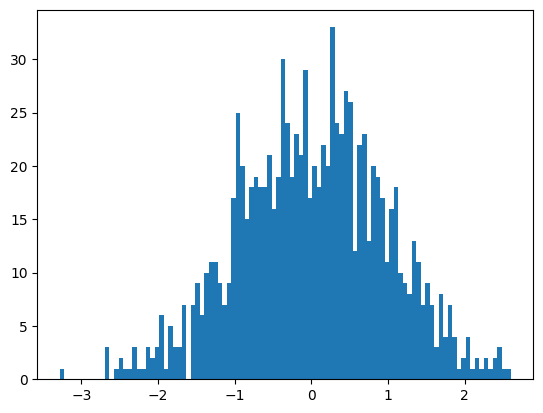
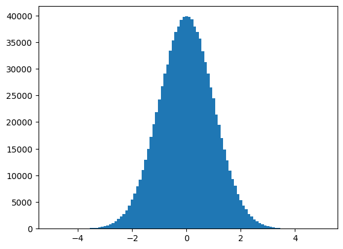
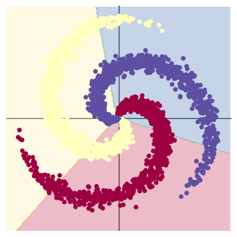
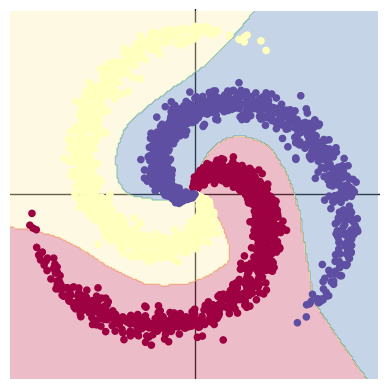

# 研一周报
周报时间：2024.8.6-2.24.8.30

## 一、当前任务

学习浅层神经⽹络、⽣物神经元到单层感知器，多层感知器，反向传播和梯度消失、神经⽹络到深度学习：逐层预训练，⾃编码器。


## 二、本周工作

### 1.通过视频学习浅层神经网络和神经网络到深度学习。
### 2.通过Colab平台进行代码练习pytorch基础练习和螺旋数据分类。

#### 2.1Pytorch基础练习

```python
import torch
x = torch.tensor(666)

x = torch.tensor([1,2,3,4,5,6])
print(x)

# 2*3的且值为1的tensor
x = torch.ones(2,3)
print(x)
x = torch.ones(2,3,4)
print(x)
x = torch.empty(5,3)
print(x)

# 5*3的随机tensor
x = torch.rand(5,3)
print(x)

x = torch.zeros(5,3,dtype = torch.long)
print(x)

y = x.new_ones(5,3)
print(y)

# 形如x的tensor
z = torch.randn_like(x,dtype=torch.float)
print(z)

# 以数组创建
m = torch.Tensor([[2,5,3,7],
          [4,2,1,9]])
print(m.size(0),m.size(1),m.size(),sep='--')
print(m.numel())

v = torch.arange(1,5)

m = m.float()
v = v.float()
#两个tensor相乘
m @ v

m[[0],:]@v

m + torch.rand(2,4)


# 转置
print(m.t())
print(m.transpose(0,1))


from matplotlib import pyplot as plt
# randn生成均值为0，方差为1的随机数
plt.hist(torch.randn(1000).numpy(),100);
```


```python
plt.hist(torch.randn(10**6).numpy(),100)
```




```python
a = torch.Tensor([[1,2,3,4]])
b = torch.Tensor([[5,6,7,8]])
# 在0维度拼接
print((torch.cat((a,b),0)))

#在1维度拼接
print(torch.cat((a,b),1))
```


#### 2.2螺旋数据分类
```python
!wget https://raw.githubusercontent.com/Atcold/pytorch-Deep-Learning/master/res/plot_lib.py
```


```python
import random
import torch
from torch import nn, optim
import math
from IPython import display
from plot_lib import plot_data, plot_model, set_default

device = torch.device("cuda:0" if torch.cuda.is_available() else "cpu")

# 随机数种子
seed = 12345
random.seed(seed)
torch.manual_seed(seed)

N = 1000  # 每类样本的数量
D = 2  # 每个样本的特征维度
C = 3  # 样本的类别
H = 100  # 神经网络里隐层单元的数量
```

```python
X = torch.zeros(N * C, D).to(device)
Y = torch.zeros(N * C, dtype=torch.long).to(device)
for c in range(C):
    index = 0
    t = torch.linspace(0, 1, N) # 在[0，1]间均匀的取10000个数，赋给t
    # 根据公式计算出三类样本
    inner_var = torch.linspace( (2*math.pi/C)*c, (2*math.pi/C)*(2+c), N) + torch.randn(N) * 0.2
    # 每个样本的(x,y)坐标都保存在 X 里
    # Y中存储的是样本的类别，分别为 [0, 1, 2]
    for ix in range(N * c, N * (c + 1)):
        X[ix] = t[index] * torch.FloatTensor((math.sin(inner_var[index]), math.cos(inner_var[index])))
        Y[ix] = c
        index += 1

print("Shapes:")
print("X:", X.size())
print("Y:", Y.size())
```

Shapes:
X: torch.Size([3000, 2])
Y: torch.Size([3000])

```python
plot_data(X, Y)
```


​   

```python
learning_rate = 1e-3
lambda_l2 = 1e-5

# 定义线性模型
model = nn.Sequential(
    nn.Linear(D, H),
    nn.Linear(H, C)
)
model.to(device)
# 交叉熵损失函数
criterion = torch.nn.CrossEntropyLoss()
optimizer = torch.optim.SGD(model.parameters(), lr=learning_rate, weight_decay=lambda_l2)
for t in range(1000):
    y_pred = model(X)
    loss = criterion(y_pred, Y)
    score, predicted = torch.max(y_pred, 1)
    acc = (Y == predicted).sum().float() / len(Y)
    print('[EPOCH]: %i, [LOSS]: %.6f, [ACCURACY]: %.3f' % (t, loss.item(), acc))
    display.clear_output(wait=True)
    optimizer.zero_grad()
    loss.backward()
    optimizer.step()
```

[EPOCH]: 999, [LOSS]: 0.861541, [ACCURACY]: 0.504


```python
print(model)
plot_model(X, Y, model)
```

Sequential(
  (0): Linear(in_features=2, out_features=100, bias=True)
  (1): Linear(in_features=100, out_features=3, bias=True)
)

    

```python
learning_rate = 1e-3
lambda_l2 = 1e-5

# 定义带有激活层的非线性模型
model = nn.Sequential(
    nn.Linear(D, H),
    nn.ReLU(),
    nn.Linear(H, C)
)
model.to(device)

criterion = torch.nn.CrossEntropyLoss()
optimizer = torch.optim.Adam(model.parameters(), lr=learning_rate, weight_decay=lambda_l2) # built-in L2

for t in range(1000):
    y_pred = model(X)
    loss = criterion(y_pred, Y)
    score, predicted = torch.max(y_pred, 1)
    acc = ((Y == predicted).sum().float() / len(Y))
    print("[EPOCH]: %i, [LOSS]: %.6f, [ACCURACY]: %.3f" % (t, loss.item(), acc))
    display.clear_output(wait=True)
    optimizer.zero_grad()
    loss.backward()
    optimizer.step()
```

[EPOCH]: 999, [LOSS]: 0.178407, [ACCURACY]: 0.949

```python
print(model)
plot_model(X, Y, model)
```

Sequential(
  (0): Linear(in_features=2, out_features=100, bias=True)
  (1): ReLU()
  (2): Linear(in_features=100, out_features=3, bias=True)
)




在本周的实验中，首先第一部分实验，练习了torch中的一些基本操作，比如向量、矩阵、张量的使用以及基本运算操作。第二部分实验，分别构建了线性分类模型和含有激活函数的非线性分类模型，并比对其效果。在两层神经网络里加入 ReLU 激活函数以后，分类的准确率得到了显著提高。

### 3.问题思考：

1、AlexNet有哪些特点？为什么可以⽐LeNet取得更好的性能？

​    AlexNet有更深的网络结构；使用了ReLu激活函数，运算更简单，且ReLU函数在不同的参数初始化方法下可以让模型更容易训练；AlexNet使用Dropout有效防止过拟合

2、激活函数有哪些作⽤？

​    引入非线性特征；控制输出范围；提供梯度信号；加速收敛；增加网络的表达能力。

3、梯度消失现象是什么？

​    在深度神经网络的训练过程中，尤其是反向传播算法中，梯度在网络的各层之间逐渐变小，最终变得非常小，导致网络的参数无法有效更新，从而训练变得缓慢或停滞。

4、神经⽹络是更宽好还是更深好？

​    选择哪个更合适取决于具体任务和目标。

​    更深的神经网络：

​        优点：学习到更多层地的特征表示，适合复杂任务，在较大规模数据集上，可以取得更好的性能。

​       缺点：训练难度大，出现梯度消失或梯度爆炸问题，需要更多的计算资源和时间。

​    更宽的神经网络：

​        优点：在较浅层次中就能提取到更多的特征，可能在较小的深度下就能提取到更好的性能。

​        缺点：网络的宽度可能增加计算资源的浪费，有冗余的神经元；容易造成过拟合尤其是在数据量比较小的时候。

5、为什么要使⽤Softmax?

​    将网络的原始输出转换为概率分布的形式；通常和交叉熵损失函数一起使用，简化损失计算；支持多类别的分类；提高模型的决策能力。

6、SGD 和 Adam 哪个更有效？

​    SGD更适合需要全局收敛性和对内存要求低的场景；Adam更适合深度学习中的复杂性优化问题，通常能更快地收敛并且在训练复杂模型时表现更好。

## 下周计划
1.学习CNN的基本结构和典型的网络结构。
2.代码练习，MNIST数据集分类，CIFAR10数据解分类，使用VGG16对CIFAR10分类。