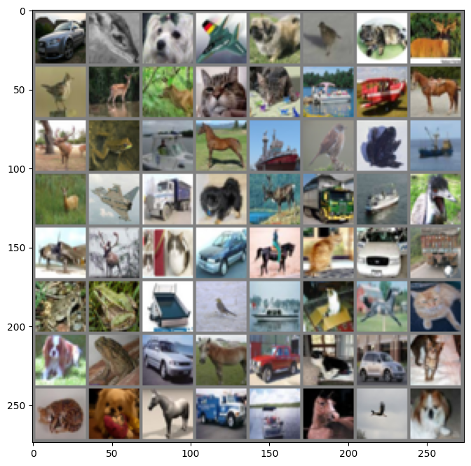
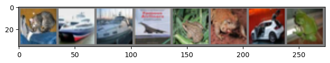

```python
def imshow(img):
    plt.figure(figsize=(8,8))
    img = img / 2 + 0.5     # 转换到 [0,1] 之间
    npimg = img.numpy()
    plt.imshow(np.transpose(npimg, (1, 2, 0)))
    plt.show()

# 得到一组图像
images, labels = next(iter(trainloader))
# 展示图像
imshow(torchvision.utils.make_grid(images))
# 展示第一行图像的标签
for j in range(8):
    print(classes[labels[j]])
```


​    

​    


    car
    deer
    dog
    plane
    dog
    bird
    cat
    deer


```python
# 定义网络
class Net(nn.Module):
    def __init__(self):
        super(Net, self).__init__()
        self.conv1 = nn.Conv2d(3, 6, 5)
        self.pool = nn.MaxPool2d(2, 2)
        self.conv2 = nn.Conv2d(6, 16, 5)
        self.fc1 = nn.Linear(16 * 5 * 5, 120)
        self.fc2 = nn.Linear(120, 84)
        self.fc3 = nn.Linear(84, 10)

    def forward(self, x):
        x = self.pool(F.relu(self.conv1(x)))
        x = self.pool(F.relu(self.conv2(x)))
        x = x.view(-1, 16 * 5 * 5)
        x = F.relu(self.fc1(x))
        x = F.relu(self.fc2(x))
        x = self.fc3(x)
        return x

net = Net().to(device)
criterion = nn.CrossEntropyLoss()
optimizer = optim.Adam(net.parameters(), lr=0.001)


# 得到一组图像
images, labels = next(iter(testloader))
# 展示图像
imshow(torchvision.utils.make_grid(images))
# 展示图像的标签
for j in range(8):
    print(classes[labels[j]])

    cat
    ship
    ship
    plane
    frog
    frog
    car
    frog

```python
outputs = net(images.to(device))
_, predicted = torch.max(outputs, 1)
```
```python
# 展示预测的结果
for j in range(8):
    print(classes[predicted[j]])
```

    cat
    plane
    ship
    plane
    cat
    frog
    car
    frog


```python
correct = 0
total = 0

for data in testloader:
    images, labels = data
    images, labels = images.to(device), labels.to(device)
    outputs = net(images)
    _, predicted = torch.max(outputs.data, 1)
    total += labels.size(0)
    correct += (predicted == labels).sum().item()
print('Accuracy of the network on the 10000 test images: %d %%' % (100 * correct / total))
```

    Accuracy of the network on the 10000 test images: 63 %


```python

```
