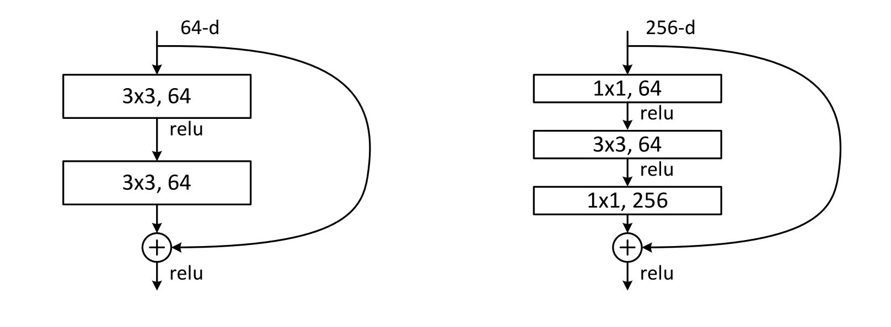
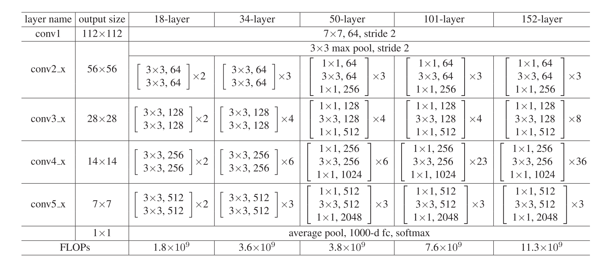
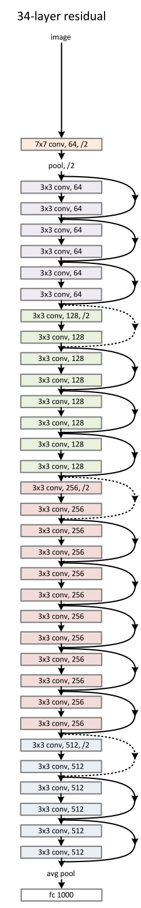
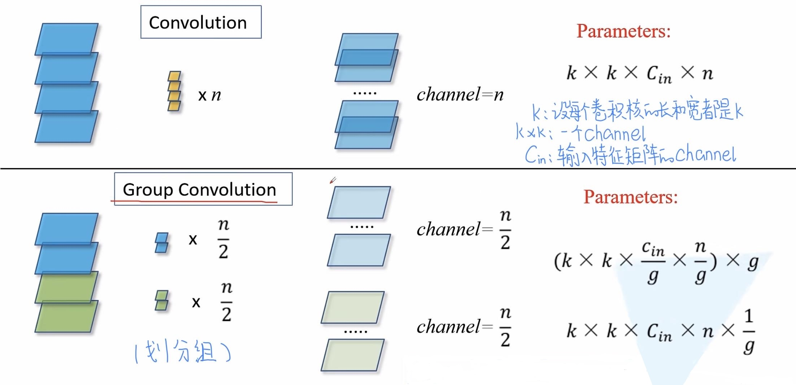
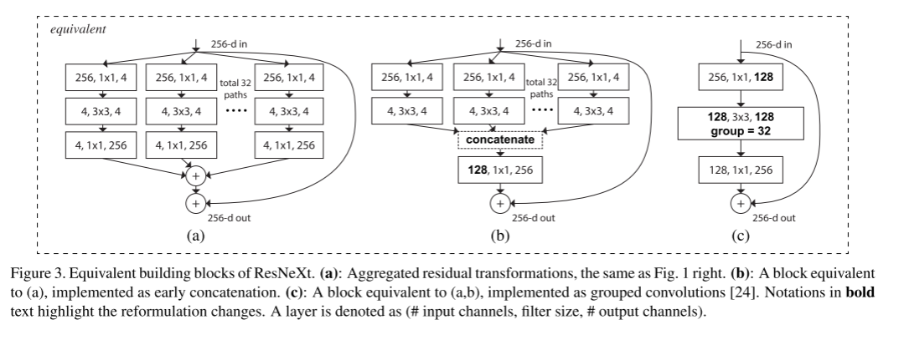
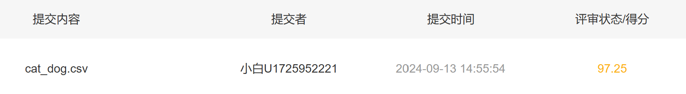

# 研一周报
周报时间：2024.9.9-2024.9.13

## 一、当前任务

学习ResNet和ResNeXt


## 二、本周工作

### 1.论文阅读和视频学习

#### 1.1 ResNet

​	传统卷积神经网络堆叠到一定网络深度时会出现两个问题，1.梯度消失或梯度爆炸；2.退化问题。

​	使用Batch Normalization可以解决梯度消失和梯度爆炸问题，但是不能解决退化问题。该论文提出Residual残差结构来减轻退化问题


可以看到随着网络的加深，效果并没有变差，反而变得更好了。

残差结构：


	对于左边的残差结构，主分支由两层3×3的卷积层组成，输出的结果与捷径分支相加，当输出数据的shape和输入数据不同时，捷径分支通过1×1的卷积核改变数据的维度。
	对于右边的残差结构，主分支第一层为1×1的卷积核降低维度，第二层为3×3的卷积核，第三层还是1×1的卷积核负责还原维度。

​	原文中给出的对于不同深度的ResNet网络结构配置



​	下图为ResNet34的网络结构图



#### 1.2 ResNeXt

​	在分组卷积层中，输入和输出的channels被分为C个groups，分别对每个group进行卷积，可以减少参数量，分成C组，那么该层的参数量减为原来的1/C。



​	优点：减少参数量；让网络学习到不同的特征，每组卷积学习到的特征不一样，获得更丰富的信息；分组卷积可以看做对原来的特征图进行了dropout，增加模型的正则性。



​	以上三种网络结构在数学计算上完全等价。
### 2.猫狗识别实验

```python
#训练集和验证集的数据集定义，Data存储图像名，Label存储标签
class MyDataset(torch.utils.data.Dataset):
    def __init__(self, data_dir, transform=None):
        self.Data = []
        self.Label = []
        self.transform = transform
        self.data_dir = data_dir
        # 读取数据
        for file in os.listdir(data_dir):
            self.Data.append(file)
            if 'cat' in file:
                self.Label.append(0)
            else:
                self.Label.append(1)

    def __len__(self):
        return len(self.Data)

    def __getitem__(self, idx):
        img = Image.open(self.data_dir + '/' + self.Data[idx])
        label = self.Label[idx]
        if self.transform:
            img = self.transform(img)
        return img, label
```

```python
# 训练数据加载器
train_dir = 'data/train'
train_data = MyDataset(train_dir, transform=train_transform)
train_loader = torch.utils.data.DataLoader(train_data, batch_size=128, shuffle=True)
```

```python
# 使用官方预训练的模型
model = models.resnet34(weights=models.ResNet34_Weights.DEFAULT)
model.fc = nn.Linear(512, num_classes)
```

```python
# 训练并保存模型参数
model = model.to(device)

criterion = nn.CrossEntropyLoss()
optimizer = optim.Adam(model.parameters(), lr=0.0001)

num_epochs = 10

for epoch in range(num_epochs):
    model.train()
    for i,(x,y) in enumerate(train_loader):
        x = x.to(device)
        y = y.to(device)
        optimizer.zero_grad()
        outputs = model(x)
        loss = criterion(outputs, y)
        loss.backward()
        optimizer.step()
        print('epoch{} loss:{}'.format(epoch, loss.item()))

torch.save(model.state_dict(), 'cat_dog.pth')
```

```python
# 验证数据加载
val_dir = 'data/val'
val_data = MyDataset(val_dir, transform=train_transform)
val_loader = torch.utils.data.DataLoader(val_data, batch_size=128, shuffle=False)
```


```python
# 使用验证数据测试准确率
total = 0
correct = 0
model.eval()
for i,(x,y) in enumerate(val_loader):
    x = x.to(device)
    y = y.to(device)
    outputs = model(x)
    _, predicted = torch.max(outputs.data, 1)
    total += y.size(0)
    correct += (predicted == y).sum().item()
print(correct / total)
```

0.969

可以看到准确率达到96.9%

```python
# 定义测试集，不同的是，使用Label存储图片编号
class TestDataset(torch.utils.data.Dataset):
    def __init__(self, data_dir, transform=None):
        self.Data = []
        self.Label = []
        self.data_dir = data_dir
        self.transform = transform
        for i in range(2000):
            self.Data.append(str(i)+'.jpg')
            self.Label.append(str(i))
    def __len__(self):
        return len(self.Data)

    def __getitem__(self, idx):
        img = Image.open(test_dir + '/' + self.Data[idx])
        if self.transform:
            img = self.transform(img)
        label = self.Label[idx]
        return img,label
```


```python
test_dir = 'data/test'
testDataset = TestDataset(test_dir,train_transform)
test_loader = torch.utils.data.DataLoader(testDataset, batch_size=1, shuffle=False)
```


```python
#进入模型测试，并将结果存入result数组，序号存入label数组
model.to(device)
model.eval()
result = []
label = []
for i,(x,y) in enumerate(test_loader):
    x = x.to(device)
    label.append(y[0])
    y = model(x).cpu()
    _,predicted = torch.max(y,1)
    result.append(predicted.tolist()[0])
```


```python
#定义相关函数，将结果按照规定形式写入csv文件
import csv
def toCSV(a, b, filename):
    with open(filename, 'w', newline='') as f:
        writer = csv.writer(f)
        for i in range(len(a)):
            writer.writerow([a[i], b[i]])
```


```python
toCSV(label,result,'cat_dog.csv')
```

将得到的csv文件上传至网站进行评测，结果如下



可以看到，准确率达到97.25%。

## 3.问题思考：

#### 1.Residual learning 的基本原理？

​	恒等映射：在每个残差块中，将输入直接连接到输出，引入到后面的层，而不是仅仅依靠网络中的非线性变换，可以看作是输入保持不变的恒等映射。残差表示：每个残差块不直接学习目标函数，而是学习残差，即输入与目标之间的差值。

#### 2.Batch Normailization 的原理，思考 BN、LN、IN 的主要区别。

​	对每个批次中的每个神经元的激活值，BN将其标准化均值为0，标准差为1的分布。

区别：LN实在每一个样本的每一层神经元进行归一化，而不是batch上；IN只对每个样本的单通道内进行归一化，即对每个通道独立计算均值和方差，而不考虑整个batch或层的其他通道。

#### 3.为什么分组卷积可以提升准确率？既然分组卷积可以提升准确率，同时还能降低计算量，分组数量尽量多不行吗？

​	减少了参数数量；提高了特征多样性；增强了模型的灵活性。

​	不行。极端情况下退化为深度卷积，如果分组数量等于输入通道数，那么每个卷积核只作用于一个通道；会减少卷积组内的特征交互；需要平衡计算效率和模型表现。

## 下周计划

​	学习MobileNet , ShuffleNet, SENet&CBAM 神经网络，并完成相关代码实验。
