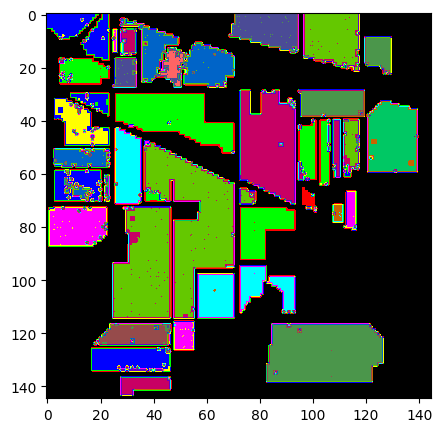

# 研一周报
周报时间：2024.9.16-2024.9.20

## 一、当前任务

​	论文阅读和代码学习


## 二、本周工作

### 1.论文阅读和视频学习

#### 1.1 MobileNet V1&V2

​	传统卷积网络内存需求大、运算量大，导致无法再移动设备和嵌入式设备中使用。MobileNet相比于传统卷积神经网络在准确率小幅度下降的情况下大大减少了模型参数和运算量。


使用DW+PW的卷积方式，从理论上来讲可以大大降低需要计算量。


​	MobileNet V2相比于V1网络，准确率更高，模型更小。提出了 Inverted Residuals（倒残差结构）和Linear Bottlenecks。


​	和残差卷积神经网络的先降维、卷积，再升维不同的是，倒残差结构先进行升维、卷积，再进行降维。


​	再模型块的最后输出部分，弃用了非线性的激活函数，直接使用全连接层进行变换输出。


​	MobileNet V2的结构

#### 1.2 MobileNet V3

​	V3相对于V2作出了三处改进，分别为更新Block、重新设计耗时结构、重新设计激活函数。


#### 1.3 ShuffleNet V1

​	分组卷积虽然可以减少参数的计算量，但是分组卷积中不同组之间的信息并没有互相交流。


​	在ShuffleNet中，允许分组卷积从不同的组中获取输入数据，从而实现输入通道和输出通道相关联 。


​	这是ShuffleNet网络中的两个基本Block，左边的结构步长为1，和shortcut分支的内容进行相加；右边的结构，步长为2，shortcut需要经过一个3×3步长为2的平均池化层，再和分组卷积的输出内容进行拼接而不是相加。


上图为ShuffleNet的网络结构，根据论文，一般解决相关问题时，选取g=3。

#### 1.4 SENet

​	SENet的核心思想是通过通道注意力机制对不同的通道进行加权，从而提高网络对重要特征的敏感性，增强特征表示能力。通过一下两个步骤实现：

​	Squeeze（压缩）对每个通道的空间信息进行全局平均池化，生成一个通道的全局描述。
​	Excitation（激励）：通过全连接层和激活函数生成通道权重，并对原始特征图进行重校准。


​	全局平均池化（Global Average Pooling）操作将每个通道的 H×W空间信息压缩为一个单一的数值。这一步生成了一个形状为 (N,C,1,1)的特征向量。

​	将通道描述通过全连接层和非线性激活函数（通常是 ReLU 和 Sigmoid），生成每个通道的权重。这些权重用于对原始特征图的每个通道进行加权。

​	使用生成的通道权重对原始特征图的每个通道进行加权。最终，输出特征图通过乘法操作与通道权重相结合。

### 1.2 代码实现高光谱分类


```python
# 模型
class_nums = 16
inchannels = 30
patch_size = 25

class HybridSN(nn.Module):
  def __init__(self):
    super(HybridSN, self).__init__()
    self.inchannel = inchannels
    self.patch_size = patch_size
    self.class_nums = class_nums
    self.conv1 = nn.Sequential(
        nn.Conv3d(in_channels = 1,out_channels = 8, kernel_size=(7,3,3)),
        nn.ReLU(),
    )
    self.conv2 = nn.Sequential(
        nn.Conv3d(in_channels = 8,out_channels = 16, kernel_size=(5,3,3)),
        nn.ReLU(),
    )
    self.conv3 = nn.Sequential(
        nn.Conv3d(in_channels = 16,out_channels = 32, kernel_size=(3,3,3)),
        nn.ReLU(),
    )
    self.x1_shape = self.get_shape1()

    self.conv4 = nn.Sequential(
        nn.Conv2d(in_channels = self.x1_shape[1]*self.x1_shape[2],out_channels = 64, kernel_size=(3,3)),
        nn.ReLU(),
    )
    self.x2_shape = self.get_shape2()
    self.fc1 = nn.Sequential(
        nn.Linear(self.x2_shape[1]*self.x2_shape[2]*self.x2_shape[3],256),
        nn.ReLU(),
        nn.Dropout(0.4),
    )
    self.fc2 = nn.Sequential(
        nn.Linear(256,128),
        nn.ReLU(),
        nn.Dropout(0.4),
    )
    self.fc3 = nn.Linear(128,self.class_nums)

  def get_shape1(self):
    x = torch.zeros(1,1,self.inchannel,self.patch_size,self.patch_size)
    with torch.no_grad():
      x = self.conv1(x)
      x = self.conv2(x)
      x = self.conv3(x)
    return x.shape

  def get_shape2(self):
    x = torch.zeros(1,self.x1_shape[1]*self.x1_shape[2],self.x1_shape[3],self.x1_shape[4])
    with torch.no_grad():
      x = self.conv4(x)
    return x.shape

  def forward(self,x):
    x = self.conv1(x)
    x = self.conv2(x)
    x = self.conv3(x)
    x = x.view(x.size(0), x.size(1)*x.size(2), x.size(3),x.size(4))
    # print(x.shape)
    x = self.conv4(x)
    x = x.view(x.size(0),x.size(1)*x.size(2)*x.size(3))
    # print(x.shape)
    x = self.fc1(x)
    x = self.fc2(x)
    out = self.fc3(x)
    return out

```


```python
# 对高光谱数据 X 应用 PCA 变换
def applyPCA(X, numComponents):
    newX = np.reshape(X, (-1, X.shape[2]))
    pca = PCA(n_components=numComponents, whiten=True)
    newX = pca.fit_transform(newX)
    newX = np.reshape(newX, (X.shape[0], X.shape[1], numComponents))
    return newX

# 对单个像素周围提取 patch 时，边缘像素就无法取了，因此，给这部分像素进行 padding 操作
def padWithZeros(X, margin=2):
    newX = np.zeros((X.shape[0] + 2 * margin, X.shape[1] + 2* margin, X.shape[2]))
    x_offset = margin
    y_offset = margin
    newX[x_offset:X.shape[0] + x_offset, y_offset:X.shape[1] + y_offset, :] = X
    return newX

# 在每个像素周围提取 patch ，然后创建成符合 keras 处理的格式
def createImageCubes(X, y, windowSize=5, removeZeroLabels = True):
    # 给 X 做 padding
    margin = int((windowSize - 1) / 2)
    zeroPaddedX = padWithZeros(X, margin=margin)
    # split patches
    patchesData = np.zeros((X.shape[0] * X.shape[1], windowSize, windowSize, X.shape[2]))
    patchesLabels = np.zeros((X.shape[0] * X.shape[1]))
    patchIndex = 0
    for r in range(margin, zeroPaddedX.shape[0] - margin):
        for c in range(margin, zeroPaddedX.shape[1] - margin):
            patch = zeroPaddedX[r - margin:r + margin + 1, c - margin:c + margin + 1]
            patchesData[patchIndex, :, :, :] = patch
            patchesLabels[patchIndex] = y[r-margin, c-margin]
            patchIndex = patchIndex + 1
    if removeZeroLabels:
        patchesData = patchesData[patchesLabels>0,:,:,:]
        patchesLabels = patchesLabels[patchesLabels>0]
        patchesLabels -= 1
    return patchesData, patchesLabels

def splitTrainTestSet(X, y, testRatio, randomState=345):
    X_train, X_test, y_train, y_test = train_test_split(X, y, test_size=testRatio, random_state=randomState, stratify=y)
    return X_train, X_test, y_train, y_test
```


```python
# 地物类别
class_num = 16
X = sio.loadmat('Indian_pines_corrected.mat')['indian_pines_corrected']
y = sio.loadmat('Indian_pines_gt.mat')['indian_pines_gt']

```

```python
# 训练
device = torch.device("cuda:0" if torch.cuda.is_available() else "cpu")

# 网络放到GPU上
net = HybridSN().to(device)
criterion = nn.CrossEntropyLoss()
optimizer = optim.Adam(net.parameters(), lr=0.001)

# 开始训练
total_loss = 0
for epoch in range(100):
    for i, (inputs, labels) in enumerate(train_loader):
        inputs = inputs.to(device)
        labels = labels.to(device)
        optimizer.zero_grad()
        outputs = net(inputs)
        loss = criterion(outputs, labels)
        loss.backward()
        optimizer.step()
        total_loss += loss.item()
    print('[Epoch: %d]   [loss avg: %.4f]   [current loss: %.4f]' %(epoch + 1, total_loss/(epoch+1), loss.item()))

print('Finished Training')
```

```python
# 经过模型训练后模型测试
count = 0
for inputs, _ in test_loader:
    inputs = inputs.to(device)
    outputs = net(inputs)
    outputs = np.argmax(outputs.detach().cpu().numpy(), axis=1)
    if count == 0:
        y_pred_test =  outputs
        count = 1
    else:
        y_pred_test = np.concatenate( (y_pred_test, outputs) )

# 生成分类报告
classification = classification_report(ytest, y_pred_test, digits=4)
print(classification)
```
```python
              precision    recall  f1-score   support
    
         0.0     0.9750    0.9512    0.9630        41
         1.0     0.9774    0.9097    0.9424      1285
         2.0     0.9362    0.8835    0.9091       747
         3.0     0.8986    0.9155    0.9070       213
         4.0     0.9254    0.9701    0.9473       435
         5.0     0.9833    0.9848    0.9840       657
         6.0     0.7667    0.9200    0.8364        25
         7.0     0.9705    0.9953    0.9828       430
         8.0     0.4667    0.3889    0.4242        18
         9.0     0.9159    0.9703    0.9423       875
        10.0     0.9719    0.9706    0.9712      2210
        11.0     0.8816    0.9345    0.9073       534
        12.0     0.9881    0.8973    0.9405       185
        13.0     0.9921    0.9965    0.9943      1139
        14.0     0.9185    0.9741    0.9455       347
        15.0     0.7586    0.7857    0.7719        84
    
    accuracy                         0.9526      9225
   macro avg     0.8954    0.9030    0.8981      9225
weighted avg     0.9534    0.9526    0.9525      9225
```

可以看到，准确率达到了95.26%



分类结果展示    

## 3.问题思考：

### 1. 训练HybridSN，然后多测试几次，会发现每次分类的结果都不一样，请思考为什么？

 （1）随机权重初始化。不同的初始化会导致不同的收敛路径，导致结果表现不同。

（2）数据集的随机划分。数据集如果被随机划分为训练集和验证集，每次划分都会影响模型训练结果。如果模型泛化能力较弱，差异会更加明显。

（3）随机梯度下降优化。如果使用了SGD或它的变体Adam等，会导致训练结果不一致。每次训练会从不同的batch训练，也会导致参数的更新路径不同。

（4）Batch Normalization。使用的批次不同，会导致不同的统计量，进而影响模型的学习。

### 2. 如果想要进一步提升高光谱图像的分类性能，可以如何改进？

（1）提取更丰富的数据表征。可以使用光谱-空间联合特征、多尺度特征提取。

（2）使用自编码器，可以对高光谱数据进行无监督的训练。

（3）结合传统方法。

（4）优化超参数。

### 3. depth-wise conv 和 分组卷积有什么区别与联系？

区别:

(1)卷积操作的独立性

Depth-wise卷积每个通道都有独立的卷积核，完全独立，没有跨通道的融合信息。分组卷积输入通道分为若干组，每组多个通道，这些通道会共享相同的卷积核，因此存在信息共享。

（2）参数数量和计算量

Depth-wise卷积极大减少了参数数量和计算量。分组卷积也减少了参数量和计算量，但是减少幅度比Depth-wise小。

联系：

两者的主要目的都是减少计算复杂度和参数量，提高网络的效率。

结构上相似，都是通过一定程度的通道分割来降低计算复杂度和参数量。

### 4. SENet 的注意力是不是可以加在空间位置上？

（1）直接在空间维度应用注意力。

（2）结合通道和空间注意力。

### 5. 在 ShuffleNet 中，通道的 shuffle 如何用代码实现？

```python
class ShuffleNet(nn.Module):
    def __init__(self, groups=3):
        super(ShuffleNet, self).__init__()
        self.groups = groups
    def channel_shuffle(self, x):
        batch_size, num_channels, height, width = x.size()
        
        # 保证通道数能整除组数
        assert num_channels % self.groups == 0
        
        # 每个组的通道数
        channels_per_group = num_channels // self.groups
        
        # reshape操作，将通道分组
        x = x.view(batch_size, self.groups, channels_per_group, height, width)
        
        # 对组和通道维度进行交换 (batch_size, G, channels_per_group, height, width) -> (batch_size, channels_per_group, G, height, width)
        x = torch.transpose(x, 1, 2).contiguous()
        
        # 再 reshape 回原始的形状 (batch_size, num_channels, height, width)
        x = x.view(batch_size, num_channels, height, width)
        return x
    
    def forward(self, x):
        x = self.channel_shuffle(x)
        return x
```

