# 研一周报
周报时间：2024.9.23-2024.9.27

## 一、当前任务

1.视频学习生成式对抗网络 GAN, CGAN, DCGAN；Diffusion模型。

2.代码练习

## 二、本周工作

### 1.视频学习

#### 1.1 GAN

​	GAN模型是两个网络的组合：生成器（Generator）负责生成模拟数据，判别器（Discriminator）负责判断输入的数据是真实的还是生成的。生成器需要不断优化自己的生成网络让判别网络无法判别，而判别器要优化自己，使判断更精确。二者为对抗关系额，所以叫对抗网络。

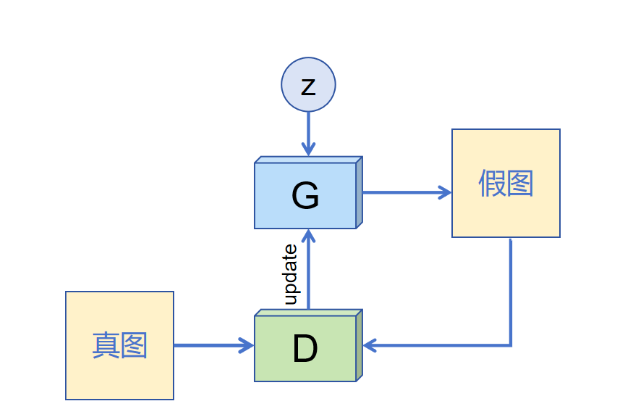

GAN的形成过程:

​	z是随机噪声。

​	D通过真图和假图的数据，进行1个二分类神经网络，得出true和fake。

​	G根据一串随机数就可以捏造除一个假图像，传到D中，D负责判别是真图还是假图，给出一个score。

在最理想的情况下，G生成的图片G(z)，可以得到D(G(z))=1，可以说达到了以假乱真的程度。

训练过程：

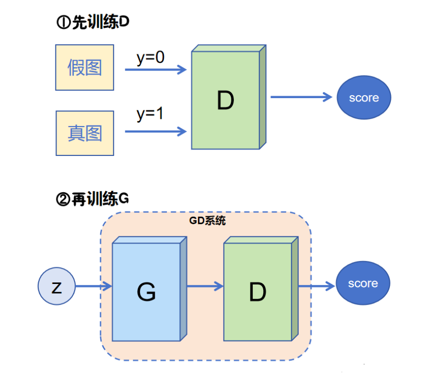

​	1.随机生成一组潜在向量z，并使用生成器生成一组假数据。

​	2.将一组真实数据和一组假数据作为输入，训练判别器。

​	3.使用生成器生成一组新的假数据，并训练判别器。

​	4.重复步骤2和3，直到生成器生成的假数据与真实数据分布相似。

#### 1.2 CGAN

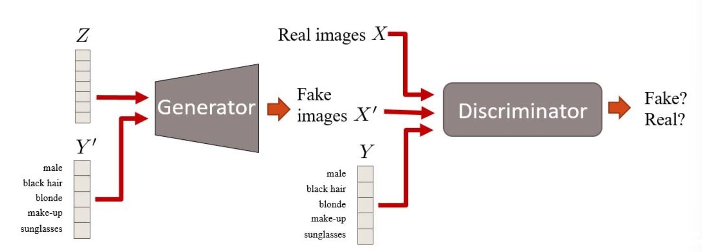

​	原本GAN网络的输入是一个N*1维的高斯噪声，但不知道每一维经过映射能控制生成的什么信息。于是，把其中的某一个维度不再输入噪声，而是训练数据的Label信息，这样就可以通过控制这个Label值来决定生成图像的种类。

#### 1.3 DCGAN

​	在原本GAN网络的基础上，

​	1.将max-pooling替换为卷积层。

​	2.用逆卷积来进行上采样

​	3.取消全连接层。

​	4.全面采用Batch Normalization。

#### 1.4 Diffusion
##### 1.4.1 自编码器（Auto Encoder）

​	AE包含两部分Encoder和Decoder。Encoder负责将输入数据进行压缩，将n维输入数据通过Hidden layer压缩成m维数据（m<<n），即通过编码器学习参数，得到一个latent code；Decoder负责还原数据，以损失最小的方式恢复原始数据。

​	局限：如果我们用1张全月图和1张半月图去训练一个AE，经过训练可以很好的还原出这两张图片。然而，在latent code中间的一点，即两张图片中间处一点，交给解码器解码，直觉上会得到一个介于全月图和半月图的图片，然而事实上得出的图片不仅模糊而且乱码。

​	一个直观的解释是AE的Encoder和Decoder都使用了DNN，DNN是一个非线性的变换过程，因此在latent space上的点与点之间transform往往没有规律可循。

##### 1.4.2 变分自编码器

​	VAE就是在原本AE结构上，给编码添加合适的噪声。将input输入到NN Encoder，计算出两组编码，一组为均值编码，另一组为控制噪声干扰程度的方差编码。方差编码主要为噪声编码分配权重。最后加权叠加，得到新的latent code。

##### 1.4.3 Diffusion model

​	生成式模型的本质是一组概率分布。如下图所示，左边是一个训练集，里面所有的数据都是从某个数据中独立分布取出的随机样本Pdata。右边就是生成式模型，在这种概率分布中，找出一个分布使得它离Pdata最近。接着在上采新的样本，可以获得源源不断的数据。

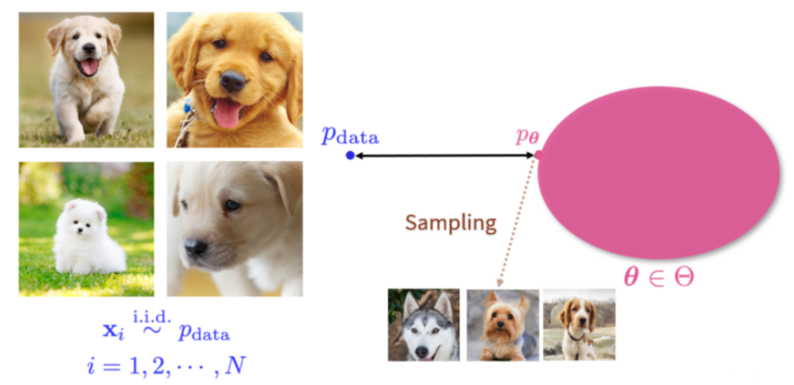

### 2.代码练习

​	学习王贯安的GAN, CGAN, DCGAN代码，并且运行。由于时间和资源有限，对每种模型的算法仅训练100轮次。并展示生成结果。

代码地址：https://github.com/wangguanan/Pytorch-Basic-GANs

#### 2.1 GAN

ECOCH:20
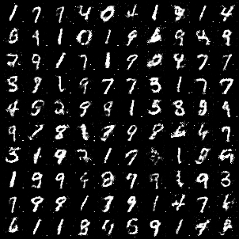

ECOCH:40
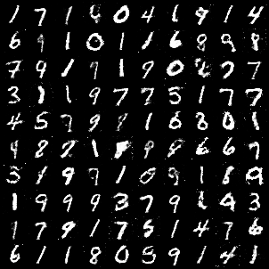

ECOCH:60
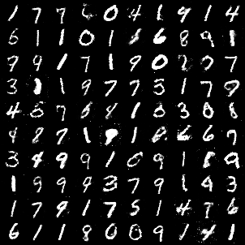

ECOCH:80
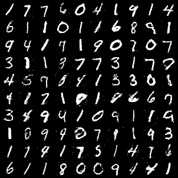

ECOCH:100
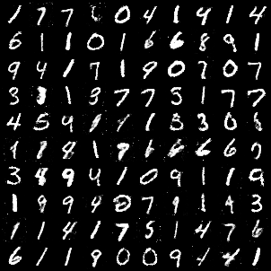

#### 2.2 CGAN

ECOCH:20
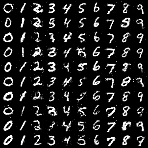

ECOCH:40
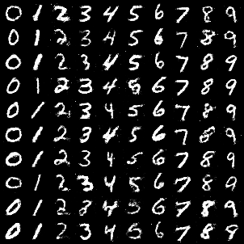

ECOCH:60
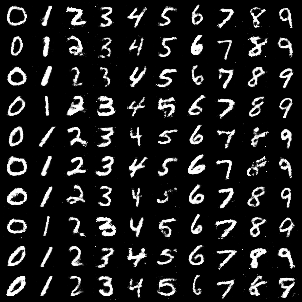

ECOCH:80
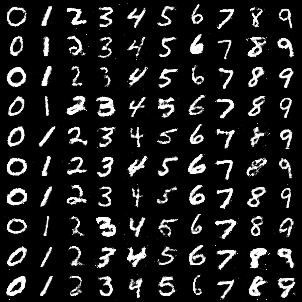

ECOCH:100
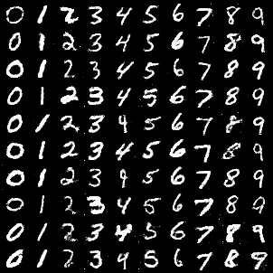

#### 2.3 DCGAN

ECOCH:20
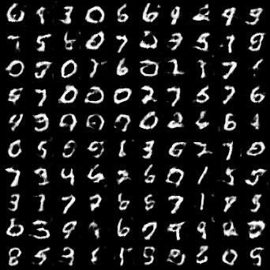

ECOCH:40
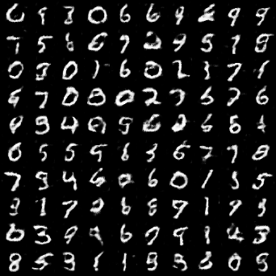

ECOCH:60
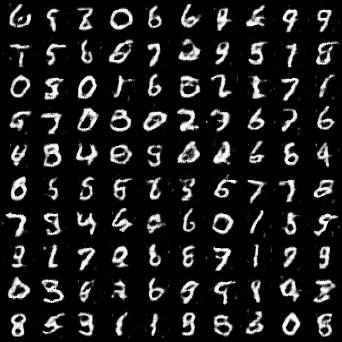

ECOCH:80
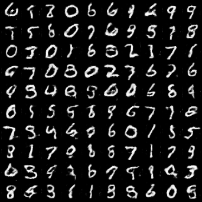

ECOCH:100
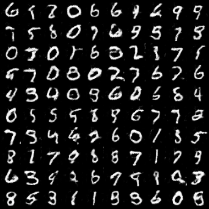

